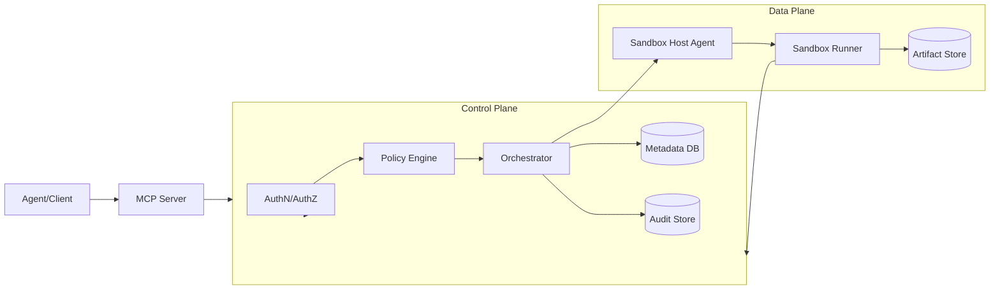
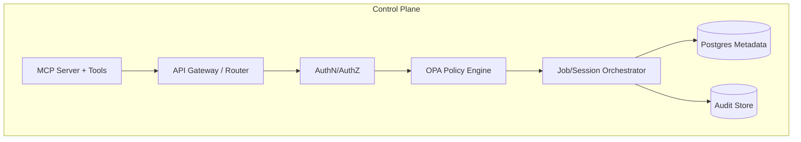
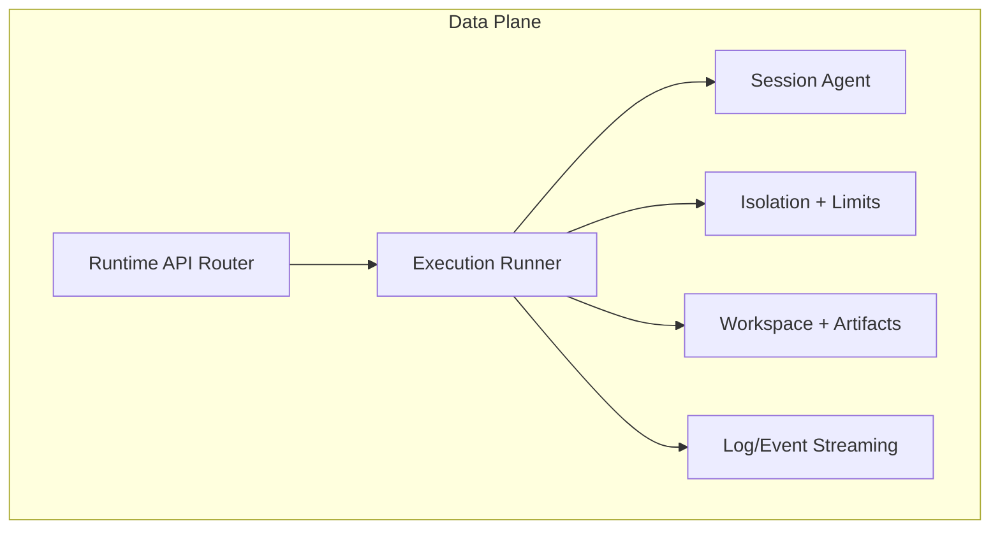
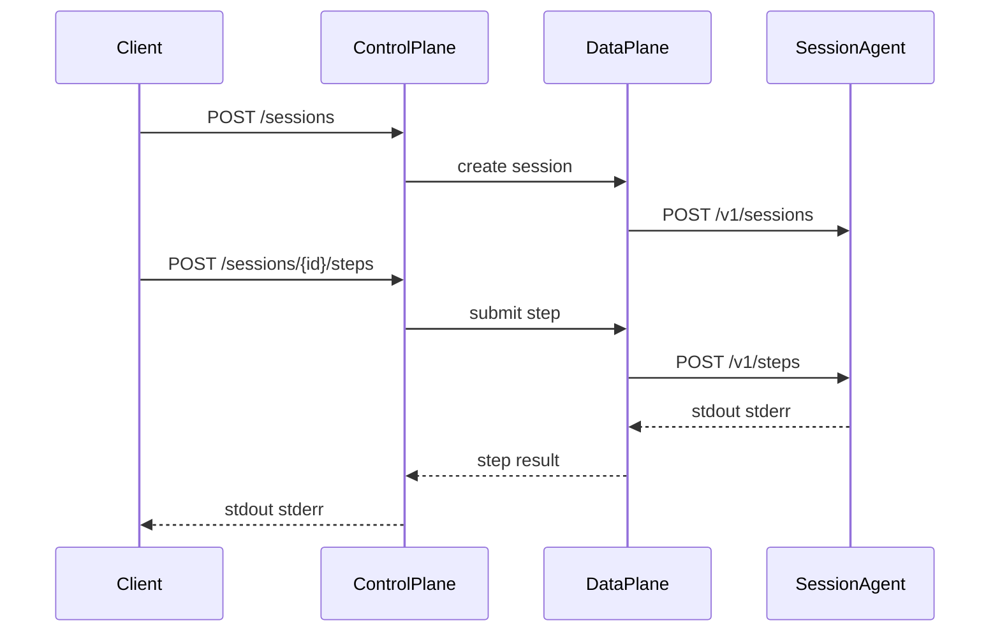
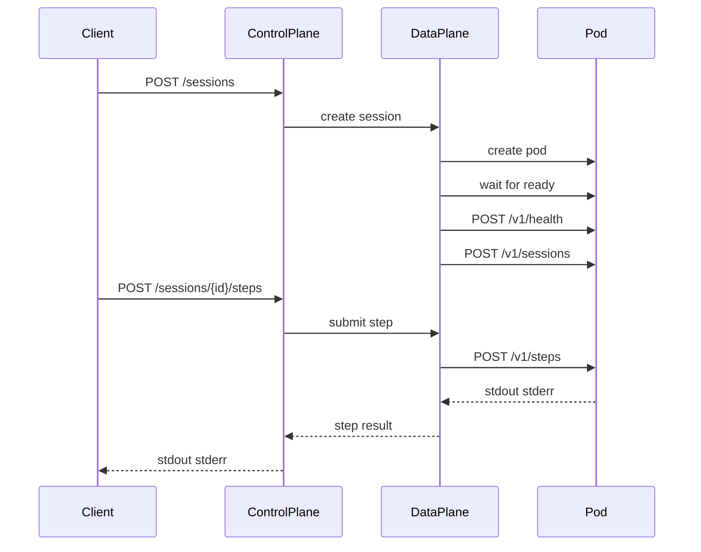

# Sandboxed Code Execution Service

An internal service that lets LLM-based agents execute untrusted code in isolated sandboxes with strong tenant isolation, policy enforcement, and full auditability.

Detailed design: see `architecture/sandbox-executor.md`.

## Repository layout

- `control-plane/`: API gateway, auth, policy, orchestration, audit, MCP server
- `data-plane/`: sandbox runtime, execution runner, isolation, workspace, telemetry
- `session-agent/`: in-pod session agent for step execution
- `shared/`: shared types and error contracts
- `deploy/`: Kubernetes manifests and Helm charts
- `specs/`: feature specs, plans, tasks, and contracts
- `architecture/`: detailed design and diagrams

### Module boundaries

- Control plane owns:
  - AuthN/AuthZ and tenant context
  - Policy evaluation (OPA)
  - Job/session lifecycle orchestration
  - Audit trail and metadata persistence
  - MCP tool interface
- Data plane owns:
  - Sandbox provisioning and execution
  - Session routing to per-session runtime agents
  - Resource limits and network egress enforcement
  - Workspace lifecycle and artifact capture
  - Log/event streaming
 - Session agent owns:
  - Step execution within a session runtime
  - Stdout/stderr capture and response formatting

## High-level architecture



## Control plane components



## Data plane components



## Getting started

### Prerequisites

- Go 1.23
- Docker (for container builds)

### Build

```bash
make build-control-plane
make build-data-plane
make build-session-agent
```

### Run tests

```bash
make test
```

### Run locally

```bash
ENV=dev DATA_PLANE_URL=http://localhost:8081 make run-control-plane
ENV=dev make run-data-plane
ENV=dev SESSION_AGENT_AUTH_BYPASS=true make run-session-agent
```

### Local testing (session-agent)

```bash
curl -s http://localhost:9000/v1/health

curl -s -X POST http://localhost:9000/v1/sessions \
  -H 'Content-Type: application/json' \
  -d '{"sessionId":"session-1","runtime":"python"}'

curl -s -X POST http://localhost:9000/v1/steps \
  -H 'Content-Type: application/json' \
  -d '{"sessionId":"session-1","stepId":"step-1","code":"print(\"hello\")"}'
```

If auth bypass is disabled, include the session token:

```bash
curl -s -X POST http://localhost:9000/v1/sessions \
  -H 'Content-Type: application/json' \
  -H 'X-Session-Token: token-1' \
  -d '{"sessionId":"session-1","runtime":"python","token":"token-1"}'
```

### Docker images

```bash
docker build -f control-plane/Dockerfile -t control-plane:dev .
docker build -f data-plane/Dockerfile -t data-plane:dev .
docker build -f deploy/runtime/python/Dockerfile -t runtime-python:dev .
docker build -f deploy/runtime/node/Dockerfile -t runtime-node:dev .
```

## Configuration notes

Common environment variables:

- Control plane:
  - `ENV`, `DATA_PLANE_URL`, `DATABASE_DRIVER`, `DATABASE_URL`, `MCP_ADDR`
  - `AUTH_JWT_SECRET`, `AUTH_ISSUER`, `AUTH_AUDIENCE`
  - `AUTHZ_BYPASS` (non-production only)
- Data plane:
  - `ENV`, `RUNTIME_NAMESPACE`, `RUNTIME_CLASS`
  - `SESSION_RUNTIME_BACKEND` (`local` or `k8s`)
  - `SESSION_REGISTRY_BACKEND` (`memory` or `file`) and `SESSION_REGISTRY_PATH` (file backend)
  - `SESSION_RUNTIME_IMAGE` (fallback image for session pods)
  - `SESSION_RUNTIME_IMAGE_PYTHON`, `SESSION_RUNTIME_IMAGE_NODE`
  - `SESSION_AGENT_ENDPOINT`, `SESSION_AGENT_AUTH_MODE`, `SESSION_AGENT_PREFER`
  - `SESSION_READY_TIMEOUT` (duration, default `60s`)
  - `WORKSPACE_ROOT` (local workspace root for session files)
  - `AUTH_JWT_SECRET`, `AUTH_ISSUER`, `AUTH_AUDIENCE`
  - `AUTHZ_BYPASS` (non-production only)
- Session agent:
  - `ENV`, `SESSION_AGENT_ADDR`
  - `SESSION_AGENT_AUTH_BYPASS` (non-production only)
  - `SESSION_AGENT_AUTH_BYPASS=false` requires a per-session token passed via `X-Session-Token`

SQLite can be used for non-production testing by setting:

```bash
DATABASE_DRIVER=sqlite
DATABASE_URL=file:control-plane.db?cache=shared&mode=rwc
```

MCP tools run on a separate HTTP server and port. Set `MCP_ADDR` (for example
`:8090`) to enable the MCP server.

MCP endpoints:
- `POST /tools/jobs`, `GET /tools/jobs/{jobId}`
- `POST /tools/sessions`, `POST /tools/sessions/{sessionId}/steps`
- `POST /tools/workflows`
- `POST /tools/artifacts/upload`, `GET /tools/artifacts/{artifactId}/download`

Session notes:
- `POST /sessions` accepts an optional `runtime` (for example `python` or `node`).
- Step responses include `stdout` and `stderr` output payloads.
- Data-plane generates per-session tokens and registers them with the session-agent when auth is enforced.

Local data-plane example (routing to a locally running session-agent):

```bash
SESSION_AGENT_ENDPOINT=http://localhost:9000 \
SESSION_AGENT_AUTH_MODE=bypass \
SESSION_AGENT_PREFER=true \
ENV=dev SESSION_RUNTIME_BACKEND=local make run-data-plane
```

### Session execution flows

Local execution (session-agent on localhost):



Kubernetes execution (session-agent in pod):



### Kubernetes testing

1. Build and push runtime images with the session-agent:
   - `deploy/runtime/python/Dockerfile`
   - `deploy/runtime/node/Dockerfile`
2. Set data-plane envs:
   - `SESSION_RUNTIME_IMAGE_PYTHON`, `SESSION_RUNTIME_IMAGE_NODE`
   - `SESSION_AGENT_AUTH_MODE=enforced`
   - `SESSION_AGENT_PREFER=true`
3. Deploy control-plane and data-plane, then create a session via control-plane and submit steps.

## Additional documentation

- Detailed design and diagrams: `architecture/sandbox-executor.md`
- Feature spec and tasks: `specs/001-session-runtime-routing/`
