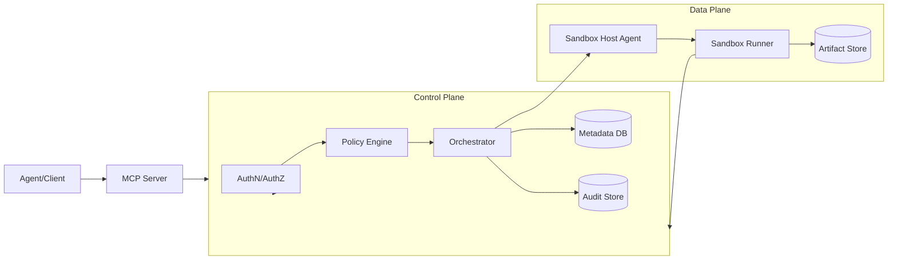
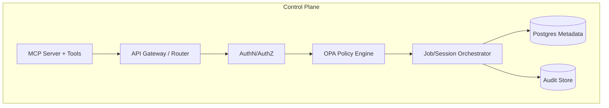
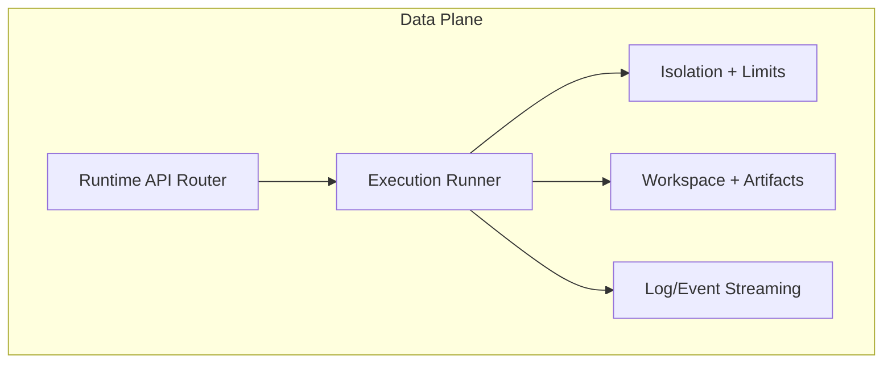

# Sandboxed Code Execution Service

An internal service that lets LLM-based agents execute untrusted code in isolated sandboxes with strong tenant isolation, policy enforcement, and full auditability.

Detailed design: see `architecture/sandbox-executor.md`.

## Repository layout

- `control-plane/`: API gateway, auth, policy, orchestration, audit, MCP server
- `data-plane/`: sandbox runtime, execution runner, isolation, workspace, telemetry
- `shared/`: shared types and error contracts
- `deploy/`: Kubernetes manifests and Helm charts
- `specs/`: feature specs, plans, tasks, and contracts
- `architecture/`: detailed design and diagrams

### Module boundaries

- Control plane owns:
  - AuthN/AuthZ and tenant context
  - Policy evaluation (OPA)
  - Job/session lifecycle orchestration
  - Audit trail and metadata persistence
  - MCP tool interface
- Data plane owns:
  - Sandbox provisioning and execution
  - Resource limits and network egress enforcement
  - Workspace lifecycle and artifact capture
  - Log/event streaming

## High-level architecture



## Control plane components



## Data plane components



## Getting started

### Prerequisites

- Go 1.23
- Docker (for container builds)

### Build

```bash
make build-control-plane
make build-data-plane
```

### Run tests

```bash
make test
```

### Run locally

```bash
ENV=dev DATA_PLANE_URL=http://localhost:8081 make run-control-plane
ENV=dev make run-data-plane
```

### Docker images

```bash
docker build -f control-plane/Dockerfile -t control-plane:dev .
docker build -f data-plane/Dockerfile -t data-plane:dev .
```

## Configuration notes

Common environment variables:

- Control plane:
  - `ENV`, `DATA_PLANE_URL`, `DATABASE_DRIVER`, `DATABASE_URL`, `MCP_ADDR`
  - `AUTH_JWT_SECRET`, `AUTH_ISSUER`, `AUTH_AUDIENCE`
  - `AUTHZ_BYPASS` (non-production only)
- Data plane:
  - `ENV`, `RUNTIME_NAMESPACE`, `RUNTIME_CLASS`
  - `AUTH_JWT_SECRET`, `AUTH_ISSUER`, `AUTH_AUDIENCE`
  - `AUTHZ_BYPASS` (non-production only)

SQLite can be used for non-production testing by setting:

```bash
DATABASE_DRIVER=sqlite
DATABASE_URL=file:control-plane.db?cache=shared&mode=rwc
```

MCP tools run on a separate HTTP server and port. Set `MCP_ADDR` (for example
`:8090`) to enable the MCP server.

MCP endpoints:
- `POST /tools/jobs`, `GET /tools/jobs/{jobId}`
- `POST /tools/sessions`, `POST /tools/sessions/{sessionId}/steps`
- `POST /tools/workflows`
- `POST /tools/artifacts/upload`, `GET /tools/artifacts/{artifactId}/download`

## Additional documentation

- Detailed design and diagrams: `architecture/sandbox-executor.md`
- Feature spec and tasks: `specs/001-sandboxed-code-execution/`
