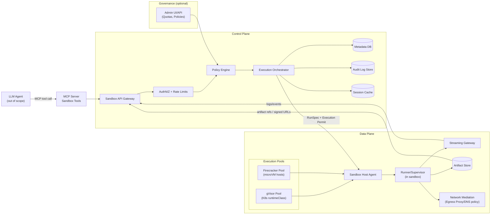
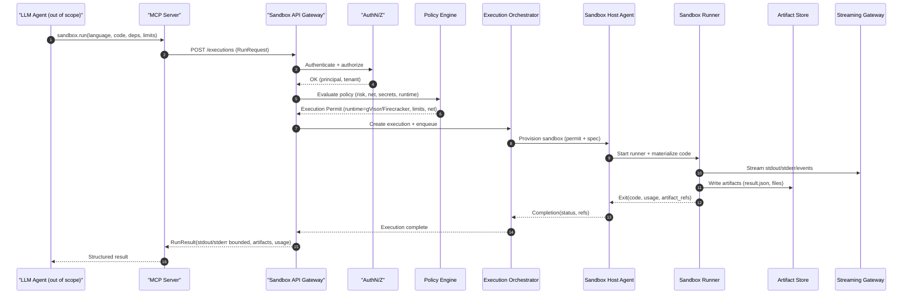
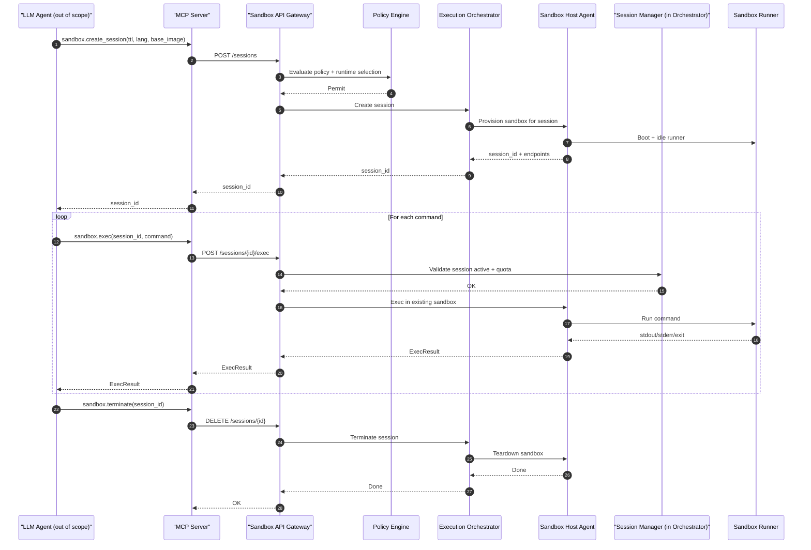
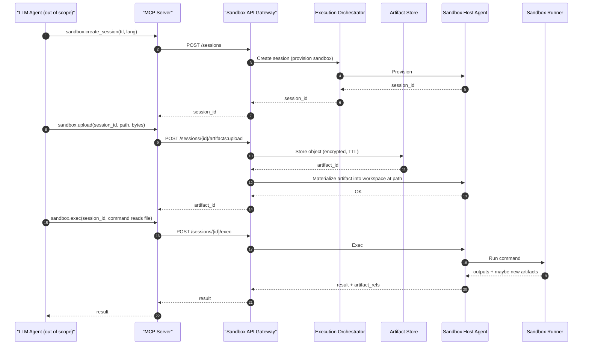
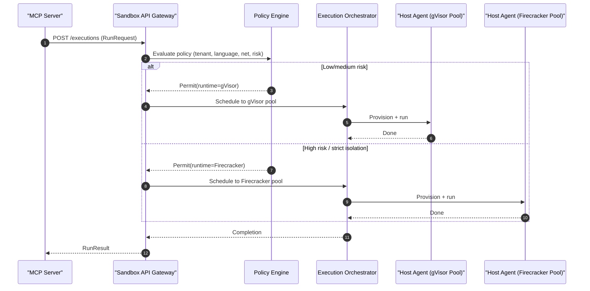

# Enterprise Sandbox Execution Service for LLM Agents

## 1. Goal and scope

Build an internal service that lets **LLM-based agents execute untrusted, generated code** in isolated sandboxes (E2B/Modal/Daytona/Deno-like). The service must provide:

- **Ephemeral, isolated execution environments** (per request/session)
- **Strong tenant isolation** (user/app/agent) with policy controls
- **Observable, auditable execution** (logs, traces, artifacts)
- A **Tool interface via an MCP Server** so agents can consume capabilities easily

### Out of scope

- Agent orchestration, planning, memory, UI, and multi-agent coordination
- Building a full IDE (though a thin developer UI is optional)

## 2. Key requirements

### Functional

- Run code in multiple languages (initially Python, Node.js; expand later)
- Execute:
  - **one-shot jobs** (run code, return stdout/stderr/result)
  - **sessions** (stateful within a sandbox for a limited TTL)
  - optional **services** (start a server in sandbox and expose via controlled proxy)
- Provide filesystem workspace + artifact upload/download
- Dependency installation (pip/npm) with allowlist/policy

### Security and compliance

- Execute untrusted code safely: no host escape, no credential exfiltration
- Network control (default deny, allowlist egress, optional internal-only)
- Resource limits (CPU, memory, disk, processes, time)
- Data controls: workspace encryption, secure deletion, secret injection policy
- Strong multi-tenancy + per-tenant policy
- Full audit trail (who/what ran, inputs, outputs, resources, network)

### Platform

- Kubernetes-first deployment (fits enterprise infra)
- Horizontal scale; burst handling
- Reliability: retry, idempotency, graceful degradation

## 3. Architectural overview

We split the system into:

- **Control Plane**: APIs, auth, policy, scheduling decisions, metadata, audit
- **Data Plane**: sandbox runtime nodes, sandbox instances, IO streaming, artifact storage

### High-level flow

1. Client/Agent calls **MCP Server tool** `sandbox.run` or `sandbox.create_session`.
2. MCP Server calls **Sandbox API Gateway** (Control Plane).
3. Control Plane authenticates, authorizes, evaluates policy, selects runtime pool.
4. Control Plane requests Data Plane to create sandbox (gVisor container or Firecracker microVM).
5. Sandbox runs code, streams logs/events back.
6. Results/artifacts stored; control plane finalizes execution record.
7. MCP returns structured results to the agent.

## 4. Sandboxing alternatives: gVisor vs Firecracker

### Option A: gVisor (user-space kernel sandbox for containers)

**What it is**: A container runtime sandbox that intercepts syscalls in user space to reduce host kernel exposure.

**Pros**

- Faster startup than microVMs in many setups
- Integrates well with Kubernetes (runtimeClass), container images, OCI ecosystem
- Good density (more sandboxes per node)
- Operational simplicity vs managing microVM lifecycle

**Cons**

- Not as strong as a true VM boundary for some threat models
- Compatibility gaps for certain syscalls / workloads
- Performance overhead vs runc for syscall-heavy workloads

**Best fit**

- High-volume ephemeral code execution, strong but not maximal isolation, cost-efficient density.

### Option B: Firecracker (microVMs)

**What it is**: A lightweight VMM that runs microVMs (used by AWS Lambda/Fargate style systems).

**Pros**

- Strong isolation boundary (VM-level)
- Great for high-risk untrusted execution and strict compliance
- Better syscall compatibility (real kernel inside VM)

**Cons**

- Higher per-sandbox overhead than gVisor (memory, startup, image management)
- More complex lifecycle management (kernel/rootfs, snapshotting)
- Node density can be lower

**Best fit**

- Highest isolation needs, executing arbitrary binaries, or strict zero-trust requirements.

### Suggested strategy

Support **both** via a **Runtime Abstraction**:

- Default: **gVisor pool** for most workloads
- High-risk / privileged language runtimes / customer-facing: **Firecracker pool**
- Policy engine decides runtime based on tenant, language, requested capabilities, risk score.

## 5. Bounded contexts and responsibilities

### Control Plane bounded contexts

#### 5.1 API & Auth Context

**Responsibility**: External interface (HTTP/gRPC), authentication/authorization.

- Verify identity (OIDC/JWT, mTLS optional)
- Enforce RBAC/ABAC (tenant, app, user, agent-id)
- Issue short-lived execution tokens for data plane

#### 5.2 Policy & Governance Context

**Responsibility**: Decide *what is allowed*.

- Runtime selection (gVisor vs Firecracker)
- Resource limits per tenant
- Network egress policy (deny/allowlist)
- Dependency install policy (package allowlist/denylist)
- File access policy (mounts, artifact size)
- Secrets policy (which secrets can be injected, redaction)

#### 5.3 Orchestration & Scheduling Context

**Responsibility**: Decide *where and how to run*.

- Choose execution pool/cluster/region
- Admission control and quota enforcement
- Job lifecycle state machine: queued → running → completed/failed → archived
- Idempotency + retries

#### 5.4 Metadata & Audit Context

**Responsibility**: Record *what happened*.

- Execution records, timings, resource usage
- Immutable audit log entries
- Provenance: code hash, inputs, artifacts, environment

#### 5.5 MCP Interface Context

**Responsibility**: Present agent-friendly tool contracts.

- MCP Server exposes tools and schemas
- Adapts agent requests into control plane API calls
- Normalizes outputs (structured results + citations to logs/artifacts)

### Data Plane bounded contexts

#### 5.6 Sandbox Runtime Context

**Responsibility**: Create and run isolated sandboxes.

- gVisor runtime nodes OR Firecracker microVM hosts
- Pull images / rootfs, create workspace
- Enforce cgroups/limits, seccomp/apparmor, VM limits
- Run commands, capture stdout/stderr, exit code

#### 5.7 IO Streaming & Events Context

**Responsibility**: Stream logs/events back to clients.

- WebSocket/gRPC stream for stdout/stderr
- Heartbeats, progress events
- Backpressure and buffering

#### 5.8 Artifact & Workspace Context

**Responsibility**: Files, uploads, downloads.

- Workspace volume (ephemeral or snapshot)
- Artifact store (S3-compatible object storage)
- Content scanning (optional), encryption, TTL cleanup

#### 5.9 Network Mediation Context

**Responsibility**: Enforce network policy.

- Default deny egress
- Allowlist via egress proxy/DNS policy
- Optional internal service access via service mesh policy

## 6. High-level components

## 6.1 Control Plane components

1. **MCP Server (Sandbox Tools)**

   - Tools: `create_session`, `run`, `exec`, `upload`, `download`, `list_artifacts`, `get_logs`, `terminate`
   - Maps agent identity → tenant/app context
   - Adds guardrails: payload validation, size/time limits

2. **Sandbox API Gateway**

   - REST/gRPC entrypoint for internal clients (incl MCP)
   - AuthN/AuthZ, request validation, rate limiting

3. **Policy Engine**

   - Central policy evaluation (OPA-style)
   - Produces an “Execution Permit”: runtime class, limits, net policy, allowed ops

4. **Execution Orchestrator**

   - Job/session lifecycle management
   - Queueing and scheduling to data plane
   - Idempotency keys, retries, cancellation

5. **Control Plane Datastores**

   - Metadata DB (Postgres)
   - Audit log store (append-only)
   - Cache (Redis) for ephemeral session state

6. **Admin / Governance UI & APIs** (optional)

   - Tenant configuration, quotas, policies

## 6.2 Data Plane components

1. **Sandbox Node Pools**

   - **gVisor Pool**: Kubernetes nodes with runtimeClass=gvisor
   - **Firecracker Pool**: nodes running microVM host agent (or managed by a VM operator)

2. **Sandbox Host Agent**

   - Runs on each node/host
   - Receives “Execution Permit” + run spec
   - Creates sandbox, mounts workspace, starts runner

3. **Runner / Supervisor (inside sandbox)**

   - Minimal init that:
     - materializes code/input
     - executes command
     - captures stdout/stderr
     - enforces in-sandbox timeouts
     - writes result.json

4. **Streaming Gateway**

   - Multiplexed log streaming; ties to execution id

5. **Artifact Store**

   - Object storage bucket with TTL lifecycle
   - Signed URLs for download (internal)

6. **Network Controls**

   - Egress proxy + DNS policy enforcement
   - Service mesh policies for internal access

## 7. Runtime abstraction

Define a common **Sandbox Runtime API** used by the orchestrator:

- `provision(spec, permit) -> sandbox_handle`
- `exec(sandbox_handle, cmd, env, timeout) -> stream_handle`
- `snapshot(sandbox_handle) -> snapshot_ref` (optional)
- `teardown(sandbox_handle)`

Two implementations:

- `GvisorRuntime`
- `FirecrackerRuntime`

## 8. MCP Server: tool surface (agent consumption)

### Core tools (minimum viable)

- `sandbox.create_session(ttl_seconds, language, base_image, env, network_policy)`
- `sandbox.run(language, code, input, timeout_seconds, cpu_millis, memory_mb, network_policy, deps)`
- `sandbox.exec(session_id, command, timeout_seconds)`
- `sandbox.upload(session_id, path, bytes | presigned_upload)`
- `sandbox.download(session_id, path | artifact_id)`
- `sandbox.get_logs(execution_id, tail_lines)`
- `sandbox.terminate(session_id | execution_id)`

### Result contract

Return structured output:

- `status`, `exit_code`
- `stdout`, `stderr` (bounded; large output via artifact)
- `artifacts[]` (id, path, size, content\_type)
- `resource_usage` (cpu\_time, max\_rss, io\_bytes)
- `provenance` (image digest, runtime\_type, policy\_id)

## 9. Security model (high level)

### Identity and isolation

- Every request carries: `tenant_id`, `app_id`, `agent_id`, `user_id` (as available)
- Isolation boundary chosen by policy: gVisor or microVM
- No host mounts; only managed workspace + ephemeral scratch

### Secrets

- Secrets injected via short-lived tokens
- Default: **no secrets** for agent-generated code unless explicitly permitted
- Redaction pipeline for logs

### Network

- Default deny egress
- Allowlist packages/endpoints via proxy (e.g., PyPI mirror, npm mirror)
- Optional: internal-only access for sanctioned tools

### Supply chain

- Curated base images per language
- Signed images; SBOMs; vulnerability scanning gates

## 10. Observability and governance

- Metrics: sandbox startup latency, run duration, failure reasons, queue depth
- Logs: orchestrator logs, sandbox logs (stdout/stderr), network audit logs
- Traces: request path across MCP → API → orchestrator → runtime
- Audit: immutable record of execution + policy decision

## 11. Scalability and reliability patterns

- Queue-based orchestration; separate API from runners
- Warm pools:
  - gVisor: warm container image cache
  - Firecracker: snapshot-based fast boot (optional)
- Sharding by tenant or workload class
- Backpressure to agents (rate limits, quotas)

## 12. Deployment topology

### Control plane

- Kubernetes namespace `sandbox-control`
- API Gateway + Orchestrator + Policy Engine + MCP Server
- Postgres/Redis managed

### Data plane

- Kubernetes namespaces per pool:
  - `sandbox-dp-gvisor`
  - `sandbox-dp-firecracker`
- Node selectors/taints to isolate pools

## 13. Component diagram (Mermaid)

## 14. Sequence diagrams (key scenarios)

### 14.1 One-shot execution (sandbox.run)

### 14.2 Stateful session with multiple exec calls

### 14.3 Artifact upload + execution using uploaded inputs

### 14.4 Policy-driven runtime selection (gVisor vs Firecracker)

## 15. Pros/cons summary table (quick)

| Dimension              | gVisor                      | Firecracker                      |
| ---------------------- | --------------------------- | -------------------------------- |
| Isolation strength     | High (container sandbox)    | Very high (VM boundary)          |
| Startup latency        | Low                         | Medium (can be low w/ snapshots) |
| Density / cost         | Better                      | Lower density (more overhead)    |
| Compatibility          | Some syscall gaps           | Full kernel compatibility        |
| Operational complexity | Lower                       | Higher                           |
| Best for               | High volume, cost-sensitive | Highest-risk untrusted execution |

## 16. Recommended MVP
1. Start with **gVisor** data plane for most workloads.
2. Add **Firecracker pool** for “high-risk” policy classes.
3. Provide MCP tools: `run` + `create_session` + `exec` + `artifacts` + `logs`.
4. Implement strict defaults: **no network**, **no secrets**, tight resource caps.

## 17. Future enhancements
- Snapshotting for fast warm sessions (esp Firecracker)
- Deterministic execution profiles for reproducibility
- Content scanning + DLP on artifacts
- Language plugins (Rust/Go/Java) with curated toolchains
- Inline notebook protocol (optional) for richer agent workflows

